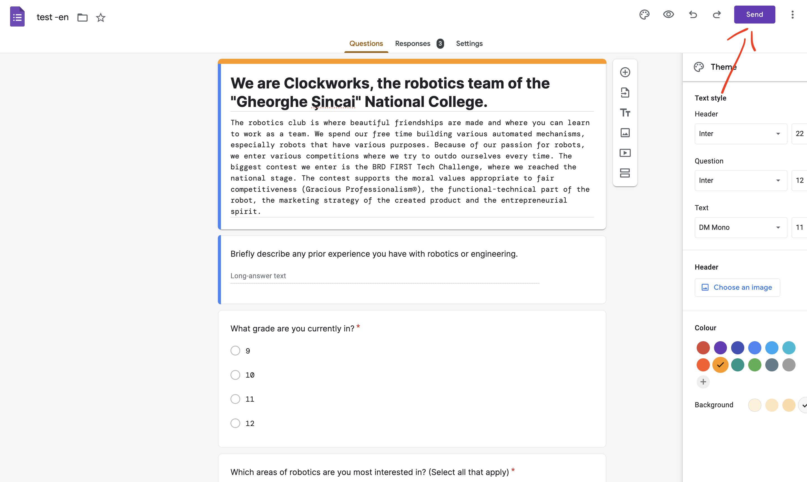
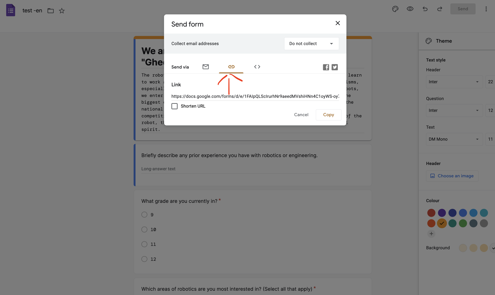
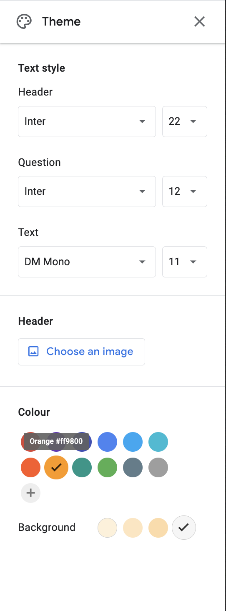

Table of contents:

- [Linkuri](#linkuri)
- [Redactarea unui nou formular](#redactarea-unui-nou-formular)
  - [Pasi de urmat:](#pasi-de-urmat)
  - [Adaugarea unei imagini](#adaugarea-unei-imagini)
  - [Exemplu](#exemplu)
- [Guidelines pentru designul unui nou formular](#guidelines-pentru-designul-unui-nou-formular)
  - [Guidelines pentru imagini](#guidelines-pentru-imagini)

## Linkuri

Folder: [`src/content/forms`](https://github.com/Clockworks-RO108/clockworks.ro/tree/master/src/content/forms)
Template: [`src/content/forms/_model.json`](https://github.com/Clockworks-RO108/clockworks.ro/tree/master/src/content/forms/_model.json)
Imagini: [`src/content/forms/images`](https://github.com/Clockworks-RO108/clockworks.ro/tree/master/src/content/projects/images)

## Redactarea unui nou formular

Formularele trebuie traduse in romana si engleza, de aceea trebuie creat cate un formular separat pentru fiecare limba.

### Pasi de urmat:

1. Dupa ce finalizati formularul, apasati butonul din dreapta sus cu labelul `Send`
   
2. Mergeti la submeniul `Send via Link`
   
3. Copiati linkul dat
   > Atentie! Cand copiati linkul formularului, asigurati-va ca omiteti secventa `?usp=sf_link` de la final!
   > Exemplu:
   > `https://docs.google.com/forms/d/e/<random>/viewform`
   > nu
   > `https://docs.google.com/forms/d/e/<random>/viewform?usp=sf_link`
4. in folderul `src/content/forms/`, creati un nou fisier (puteti copia unul dintre `_model-*.json` dupa caz) cu numele formularului (va rog ca numele sa fie kebab-case) care sa respecte template-ul din `_model-*.json`.
5. Daca formularul e in ambele limbi, ghidati-va dupa `_model-both-langs.json`, altfel dupa `_model-<lang>-only.json`

### Adaugarea unei imagini

Pentru a adauga o imagine in proiect, aceasta trebuie salvata intai in folderul de imagini linkuit mai sus, intr-un folder cu acelasi nume ca postarea(TOT KEBAB-CASE).

### Exemplu

```bash
.
└── src/content/forms
    ├─── form-no-1.json
    └─── images
         └─── form-no-1.png/jpg/whatever
```

## Guidelines pentru designul unui nou formular

Pentru a pastra un design coeziv, formularele create in Google forms trebuie sa respecte cateva cerinte de design:



1. Header:
   - font: Inter
   - size: 22px
2. Question:
   - font: Inter
   - size: 12px
3. Text:
   - font: DM Mono
   - size: 11px
4. Colour: `#ff9800`
   > Atentie! culoarea trebuie adaugata manual, apasa acel `+` mare de sub culorile preset
5. Background: Grey `#f6f6f6`

### Guidelines pentru imagini

Imaginile trebuie sa aiba un fundal transparent si sa aiba aspect 1:1(patrate)
